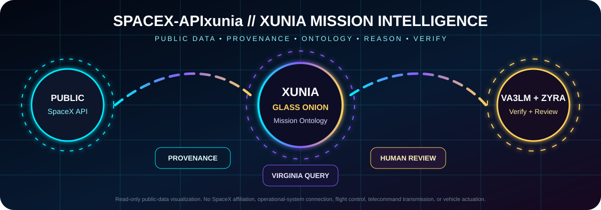

# 🚀 SpaceX API XUNIA Mission Intelligence Layer

<p align="center">
  
</p>

**Command:** `/glass mission spacex`  
**Language:** `VIRGINIA`  
**Root:** `XUNIA / XuniaDAO`

This layer converts public SpaceX REST API records into provenance-bearing XUNIA ontology objects for mission dashboards, simulation, analytics, evidence export, and governed reasoning.

## Architecture

```text
PUBLIC_SPACEX_API
  → PROVENANCE_CAPTURE
  → XUNIA_NORMALIZE
  → GLASS_ONION_ONTOLOGY
  → VIRGINIA_QUERY
  → VA3LM_REASON
  → ZYRA_VERIFY
  → HUMAN_REVIEW
```

Machine contract: [`layer.json`](./layer.json)

## Ontology

Objects:

`MISSION_LAUNCH · ROCKET · LAUNCHPAD · PAYLOAD · CAPSULE · SHIP · STARLINK_RECORD · SOURCE_EVIDENCE`

Links:

`USES_ROCKET · LAUNCHES_FROM · CARRIES_PAYLOAD · USES_CAPSULE · SUPPORTED_BY_EVIDENCE`

VIRGINIA query surface:

```text
SPACEX LATEST
SPACEX LAUNCHES
SPACEX ROCKETS
SPACEX LAUNCHPADS
MISSION TWIN STATUS
```

## Adapter

```js
import { fetchLatestLaunch } from "./mission-intel.js";

const launch = await fetchLatestLaunch();
console.log(launch);
```

Supported public read entities include launches, rockets, launchpads, payloads, capsules, ships, and Starlink records. Each normalized record carries source metadata and retrieval provenance.

## Safety boundary

This is a **public-data, read/simulation-only intelligence layer**. It does not connect to SpaceX operational systems and does not imply SpaceX affiliation or endorsement. Flight-control, vehicle-command, telecommand, control, and actuation operations are explicitly outside this layer.

## XUNIAverse

The layer feeds the XUNIA mission-twin architecture maintained in [`sonoxo/xuniadao`](https://github.com/sonoxo/xuniadao). Existing upstream ownership, Apache-2.0 licensing, trademarks, and attribution remain unchanged.
